# API Usuário-Endereço

API REST desenvolvida em .NET 8 para gerenciamento de usuários e seus endereços, utilizando banco de dados em memória e seguindo o padrão MVC.

## Diagrama de Pacotes da Arquitetura MVC


## Diagramas de Classes por Camada

### Controller e DTO Layer


### Model Layer


### Repository Layer

```mermaid
classDiagram
    IUsuarioRepository <|.. UsuarioRepository
    IEnderecoRepository <|.. EnderecoRepository
    UsuarioRepository --> AppDbContext
    EnderecoRepository --> AppDbContext

    class IUsuarioRepository {
        <<interface>>
        +ObterPorIdAsync(int) Task<Usuario>
        +ObterTodosAsync() Task<IEnumerable<Usuario>>
        +AdicionarAsync(Usuario) Task<Usuario>
        +AtualizarAsync(Usuario) Task
        +DeletarAsync(int) Task
        +ExisteAsync(int) Task<bool>
    }

    class IEnderecoRepository {
        <<interface>>
        +ObterPorIdAsync(int) Task<Endereco>
        +ObterPorUsuarioIdAsync(int) Task<IEnumerable<Endereco>>
        +AdicionarAsync(Endereco) Task<Endereco>
        +AtualizarAsync(Endereco) Task
        +DeletarAsync(int) Task
        +ExisteAsync(int) Task<bool>
    }

    class UsuarioRepository {
        -AppDbContext _context
        +ObterPorIdAsync(int) Task<Usuario>
        +ObterTodosAsync() Task<IEnumerable<Usuario>>
        +AdicionarAsync(Usuario) Task<Usuario>
        +AtualizarAsync(Usuario) Task
        +DeletarAsync(int) Task
        +ExisteAsync(int) Task<bool>
    }

    class EnderecoRepository {
        -AppDbContext _context
        +ObterPorIdAsync(int) Task<Endereco>
        +ObterPorUsuarioIdAsync(int) Task<IEnumerable<Endereco>>
        +AdicionarAsync(Endereco) Task<Endereco>
        +AtualizarAsync(Endereco) Task
        +DeletarAsync(int) Task
        +ExisteAsync(int) Task<bool>
    }
```


## Implementação dos DTOs

```csharp
// Models/DTOs/UsuarioDTO.cs
public class UsuarioDTO
{
    [Required(ErrorMessage = "O nome é obrigatório")]
    [StringLength(100, MinimumLength = 3, ErrorMessage = "O nome deve ter entre 3 e 100 caracteres")]
    public string Nome { get; set; }

    [Required(ErrorMessage = "O email é obrigatório")]
    [EmailAddress(ErrorMessage = "Email inválido")]
    [StringLength(150, ErrorMessage = "O email não pode ter mais que 150 caracteres")]
    public string Email { get; set; }

    public Usuario ToEntity()
    {
        return new Usuario
        {
            Nome = Nome,
            Email = Email,
            Enderecos = new List<Endereco>()
        };
    }

    public static UsuarioDTO FromEntity(Usuario usuario)
    {
        return new UsuarioDTO
        {
            Nome = usuario.Nome,
            Email = usuario.Email
        };
    }
}

// Models/DTOs/EnderecoDTO.cs
public class EnderecoDTO
{
    [Required(ErrorMessage = "O logradouro é obrigatório")]
    [StringLength(200, ErrorMessage = "O logradouro não pode ter mais que 200 caracteres")]
    public string Logradouro { get; set; }

    [Required(ErrorMessage = "O número é obrigatório")]
    [StringLength(10, ErrorMessage = "O número não pode ter mais que 10 caracteres")]
    public string Numero { get; set; }

    [StringLength(100, ErrorMessage = "O complemento não pode ter mais que 100 caracteres")]
    public string? Complemento { get; set; }

    [Required(ErrorMessage = "O bairro é obrigatório")]
    [StringLength(100, ErrorMessage = "O bairro não pode ter mais que 100 caracteres")]
    public string Bairro { get; set; }

    [Required(ErrorMessage = "A cidade é obrigatória")]
    [StringLength(100, ErrorMessage = "A cidade não pode ter mais que 100 caracteres")]
    public string Cidade { get; set; }

    [Required(ErrorMessage = "O estado é obrigatório")]
    [StringLength(2, MinimumLength = 2, ErrorMessage = "O estado deve ter 2 caracteres")]
    public string Estado { get; set; }

    [Required(ErrorMessage = "O CEP é obrigatório")]
    [RegularExpression(@"^\d{5}-?\d{3}$", ErrorMessage = "CEP inválido")]
    public string CEP { get; set; }

    public Endereco ToEntity(int usuarioId)
    {
        return new Endereco
        {
            Logradouro = Logradouro,
            Numero = Numero,
            Complemento = Complemento,
            Bairro = Bairro,
            Cidade = Cidade,
            Estado = Estado,
            CEP = CEP,
            UsuarioId = usuarioId
        };
    }

    public static EnderecoDTO FromEntity(Endereco endereco)
    {
        return new EnderecoDTO
        {
            Logradouro = endereco.Logradouro,
            Numero = endereco.Numero,
            Complemento = endereco.Complemento,
            Bairro = endereco.Bairro,
            Cidade = endereco.Cidade,
            Estado = endereco.Estado,
            CEP = endereco.CEP
        };
    }
}
```

## Estrutura de Pastas MVC
```
APIUsuarioEndereco/
├── Models/
│   ├── Entities/
│   │   ├── Usuario.cs
│   │   └── Endereco.cs
│   └── DTOs/
│       ├── UsuarioDTO.cs
│       └── EnderecoDTO.cs
├── Controllers/
│   ├── UsuarioController.cs
│   └── EnderecoController.cs
├── Data/
│   └── AppDbContext.cs
├── Repository/
│   ├── Interfaces/
│   │   ├── IUsuarioRepository.cs
│   │   └── IEnderecoRepository.cs
│   └── Implementations/
│       ├── UsuarioRepository.cs
│       └── EnderecoRepository.cs
└── Program.cs
```

## Pré-requisitos

- .NET 8.0 SDK
- Visual Studio 2022 ou JetBrains Rider
- Postman ou outra ferramenta para testar APIs REST

## Instalação

1. Clone o repositório
```bash
git clone [https://seu-repositorio/APIUsuarioEndereco](https://github.com/paulossjunior/CRUDAPIExample).git
```

2. Navegue até o diretório do projeto
```bash
cd APIUsuarioEndereco
```

3. Restaure os pacotes NuGet
```bash
dotnet restore
```

4. Execute o projeto
```bash
dotnet run
```

## Endpoints da API

### Usuários

#### Criar Usuário
```http
POST /api/usuario
Content-Type: application/json

{
    "nome": "João Silva",
    "email": "joao@email.com"
}
```

#### Obter Usuário por ID
```http
GET /api/usuario/{id}
```

#### Listar Todos os Usuários
```http
GET /api/usuario
```

### Endereços

#### Criar Endereço para Usuário
```http
POST /api/endereco/{usuarioId}
Content-Type: application/json

{
    "logradouro": "Rua das Flores",
    "numero": "123",
    "complemento": "Apto 101",
    "bairro": "Centro",
    "cidade": "São Paulo",
    "estado": "SP",
    "cep": "01234-567"
}
```

#### Obter Endereço por ID
```http
GET /api/endereco/{usuarioId}/{id}
```

#### Listar Endereços de um Usuário
```http
GET /api/endereco/usuario/{usuarioId}
```

## Configuração do Banco de Dados

O projeto utiliza Entity Framework Core com banco de dados em memória. A configuração está no `Program.cs`:

```csharp
builder.Services.AddDbContext<AppDbContext>(options =>
    options.UseInMemoryDatabase("TestDb"));
```

## Padrões Utilizados

- Repository Pattern
- Dependency Injection
- DTO Pattern
- RESTful API
- MVC Pattern

## Considerações de Desenvolvimento

- O banco de dados em memória é reiniciado a cada execução da aplicação
- Todas as operações são assíncronas
- Implementada validação básica de dados
- Tratamento de erros incluído
- Seguindo princípios SOLID
- Arquitetura em camadas bem definida
- DTOs com validações e mapeamentos
- Controllers com tratamento de erros

## Possíveis Melhorias

1. Adicionar autenticação e autorização
2. Implementar logs
3. Adicionar cache
4. Criar testes unitários e de integração
5. Documentação via Swagger
6. Implementar versionamento da API
7. Adicionar persistência com banco de dados real
8. Implementar padrão CQRS
9. Adicionar FluentValidation
10. Implementar AutoMapper

## Contribuição

1. Faça o fork do projeto
2. Crie sua feature branch (`git checkout -b feature/MinhaFeature`)
3. Commit suas mudanças (`git commit -m 'Adicionando nova feature'`)
4. Push para a branch (`git push origin feature/MinhaFeature`)
5. Abra um Pull Request

## Licença

Este projeto está sob a licença MIT.
